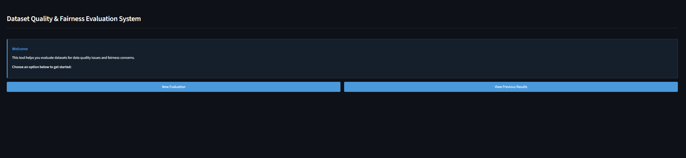
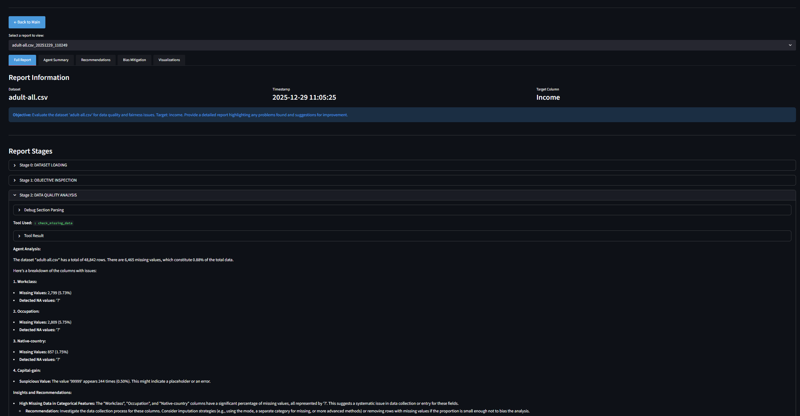
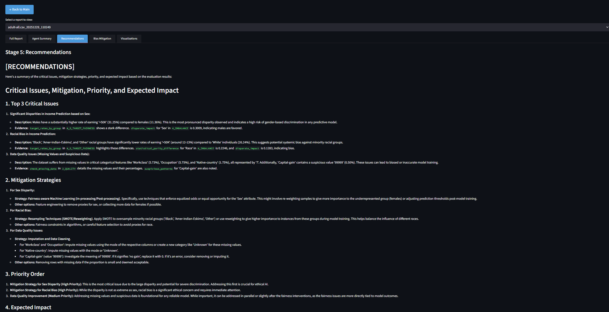
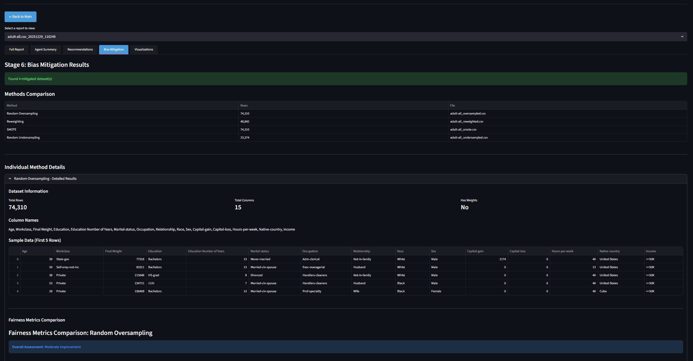
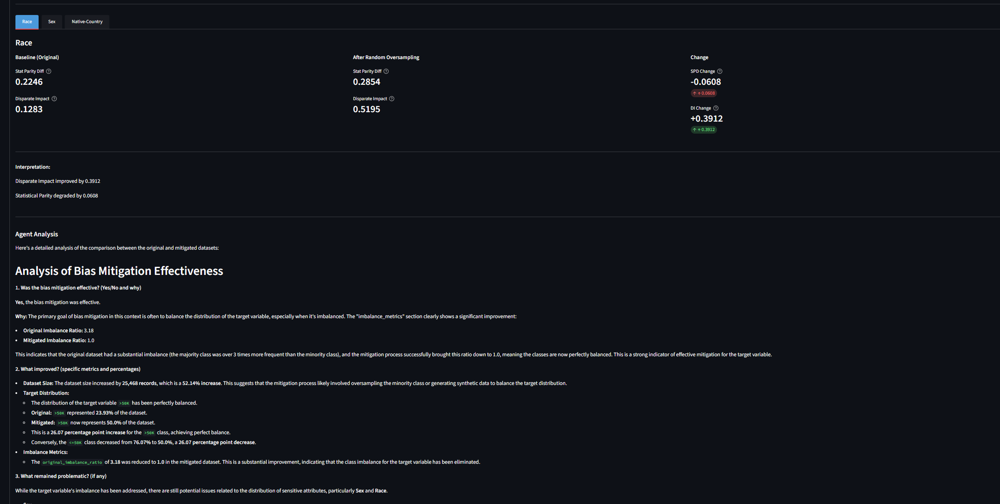
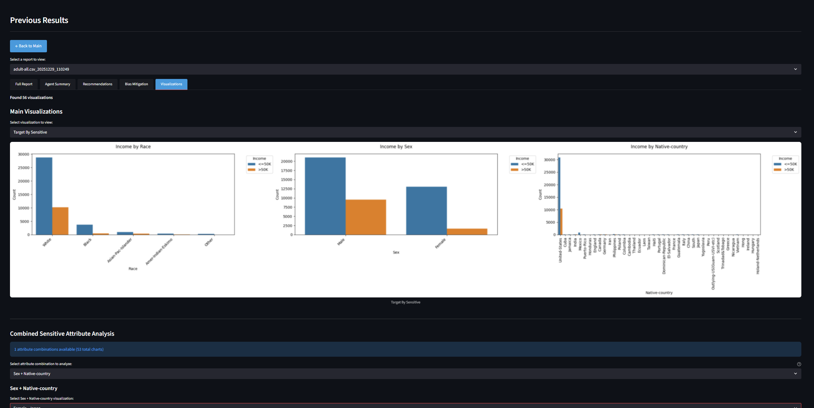

# Dataset Quality & Fairness Evaluation System

A Streamlit-based GUI application for evaluating datasets on data quality issues and fairness concerns using AI agents.

## Installation

1. Clone the repository and navigate to the project directory.

2. Install dependencies:
```bash
pip install -r requirements.txt
```

## Configuration

Create a `.env` file in `src/agents/` directory with your API keys:

```bash
# src/agents/.env
GOOGLE_API_KEY=your-google-gemini-api-key-here
OPENROUTER_API_KEY=your-openrouter-api-key-here
```

Note: At least one API key is required. The local IBM Granite model option does not require API keys but needs additional dependencies.

## Running the Application

1. Open `src/main.py` and configure the `RUN_MODE` variable:
   - Set `RUN_MODE = "gui"` for Streamlit GUI mode (default)
   - Set `RUN_MODE = "terminal"` for terminal mode

2. Run the application:
```bash
python src/main.py
```

The application will launch in the mode specified in `src/main.py`.

## GUI Screenshots


*Start Screen*


*Report Information Screen*


*Recommendations Screen*


*Mitigation Screen 1*


*Mitigation Screen 2*


*Graph Visualization Screen*
