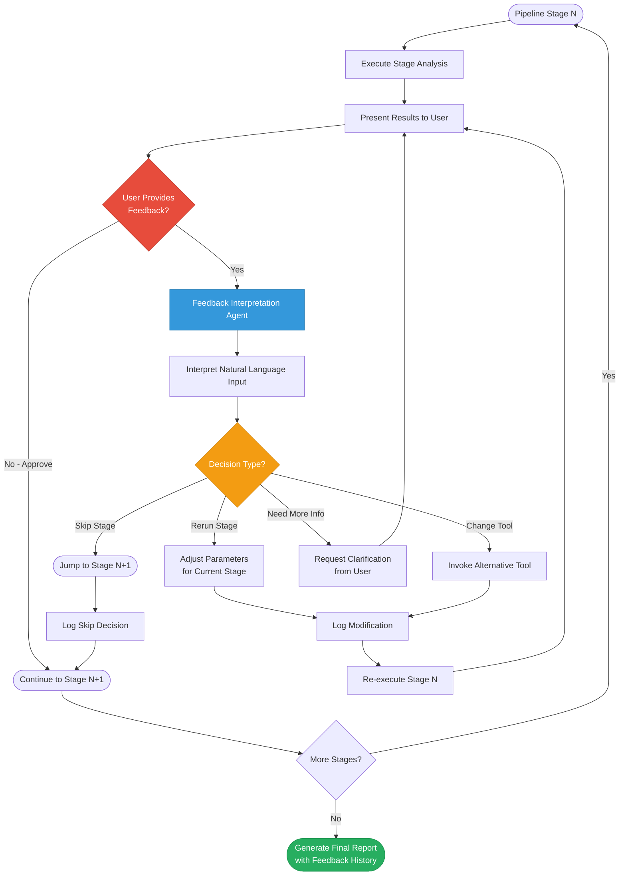

# Human-in-the-Loop Feedback Architecture Diagram

## Architecture Components

**Key Elements:**

1. **Pipeline Stage N**: Any stage in the 7-stage evaluation pipeline
2. **Feedback Interpretation Agent**: New AI component that parses natural language feedback
3. **Decision Types**:
   - **Rerun Stage**: Adjust parameters and re-execute
   - **Change Tool**: Switch to alternative analytical tool
   - **Skip Stage**: Jump to next stage if current is not relevant
   - **Need More Info**: Request user clarification
4. **Logging**: All feedback-driven modifications are tracked for transparency
5. **Final Report**: Includes complete history of human feedback and AI adaptations

**Benefits:**
- Iterative refinement based on domain expertise
- Flexible pipeline execution adapting to user needs
- Transparent decision trail for reproducibility
- Balance between automation and human control
