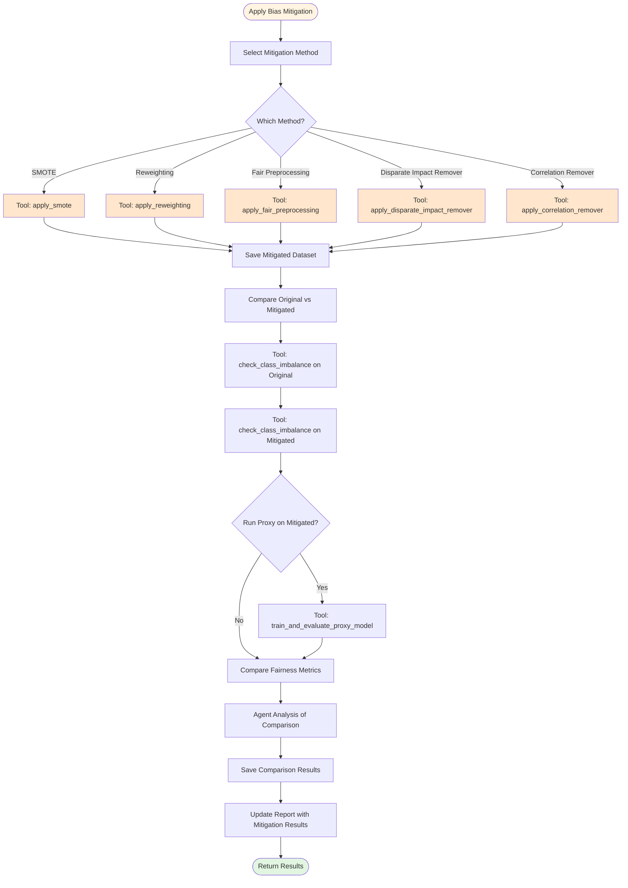
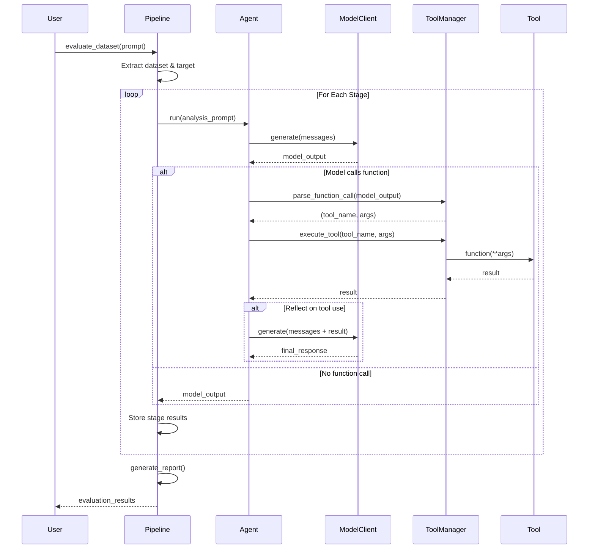

# Dataset Evaluation Pipeline - Mermaid Diagrams

## 1. Pipeline Flow Diagram

This diagram shows the complete evaluation pipeline flow from start to finish:

```mermaid
flowchart TD
    Start([User Request]) --> Init[Initialize Pipeline]
    Init --> ExtractParams[Extract Dataset Name & Target Column]
    
    ExtractParams --> Stage0[STAGE 0: Load Dataset]
    Stage0 --> |Tool: load_dataset| LoadTool[FairnessTools.load_dataset]
    LoadTool --> CheckLoad{Load Success?}
    CheckLoad --> |No| End([Return Error])
    CheckLoad --> |Yes| Stage1
    
    Stage1[STAGE 1: Objective Inspection] --> Extract[Extract User Objective]
    Extract --> Stage2
    
    Stage2[STAGE 2: Data Quality Analysis] --> QualityTool[Tool: check_missing_data]
    QualityTool --> QualityAgent[Quality Agent Analysis]
    QualityAgent --> Stage3
    
    Stage3[STAGE 3: Sensitive Attribute Detection] --> SensitiveTool[Tool: detect_sensitive_attributes]
    SensitiveTool --> SensitiveAgent[Conversational Agent Analysis]
    SensitiveAgent --> ExtractSensitive[Extract Sensitive Column Names]
    ExtractSensitive --> ConfirmOverride{Confirmed Columns Provided?}
    ConfirmOverride --> |Yes| OverrideSensitive[Use Confirmed Columns]
    ConfirmOverride --> |No| UseDet[Use Detected Columns]
    OverrideSensitive --> Stage4
    UseDet --> Stage4
    
    Stage4[STAGE 4: Imbalance Analysis] --> ImbalanceTool[Tool: check_class_imbalance]
    ImbalanceTool --> ProxyCheck{Proxy Model Enabled?}
    ProxyCheck --> |Yes| ProxyModel[Tool: train_and_evaluate_proxy_model]
    ProxyCheck --> |No| ImbalanceAgent
    ProxyModel --> ImbalanceAgent[Quality Agent Analysis]
    ImbalanceAgent --> TargetCheck{Has Target Column?}
    
    TargetCheck --> |Yes| Stage45
    TargetCheck --> |No| Stage5
    
    Stage45[STAGE 4.5: Target Fairness Analysis] --> FairnessTool[Tool: analyze_target_fairness]
    FairnessTool --> InterCheck{Selected Pairs & Proxy Enabled?}
    InterCheck --> |Yes| InterProxy[Intersectional Proxy Analysis]
    InterCheck --> |No| FairnessAgent
    InterProxy --> FairnessAgent[Fairness Agent Analysis]
    FairnessAgent --> Stage5
    
    Stage5[STAGE 5: Recommendations] --> Compile[Compile Findings]
    Compile --> RecAgent[Recommendation Agent]
    RecAgent --> Stage6
    
    Stage6[STAGE 6: Report Generation] --> GenReport[Generate Full Report]
    GenReport --> GenSummary[Generate Agent Summary]
    GenSummary --> SaveReports[Save Reports to Directory]
    SaveReports --> End2([Pipeline Complete])
    
    style Start fill:#e1f5e1
    style End fill:#ffe1e1
    style End2 fill:#e1f5e1
    style Stage0 fill:#cce5ff
    style Stage1 fill:#cce5ff
    style Stage2 fill:#cce5ff
    style Stage3 fill:#cce5ff
    style Stage4 fill:#cce5ff
    style Stage45 fill:#cce5ff
    style Stage5 fill:#cce5ff
    style Stage6 fill:#cce5ff
```

## 2. Optional: Bias Mitigation Extension Flow

This diagram shows the optional bias mitigation workflow:

## 3. Class Diagram

This diagram shows the relationships between Tool, Agent, Model, and Manager classes:

```mermaid
classDiagram
    %% Base Classes
    class BaseModelClient {
        <<abstract>>
        +generate(messages, temperature, max_tokens) str
        +supports_function_calling() bool
    }
    
    class BaseAgent {
        <<abstract>>
        -model_client: BaseModelClient
        +__init__(model_client, model_name)
        +ask_model(messages, temperature, max_tokens)
        +run(user_message)* str
        +get_system_prompt()* str
    }
    
    class Tool {
        -name: str
        -function: callable
        -description: str
        -parameters: dict
        -dict_description: dict
        +__init__(name, function, description, parameters)
    }
    
    class ToolManager {
        -list_of_tools: list~Tool~
        -tools: dict
        -tool_descriptions: list
        +__init__(tools)
        +_build_tool_mappings()
        +get_tool_descriptions_json() str
        +parse_function_call(model_output) tuple
        +execute_tool(tool_name, args) Any
        +has_tool(tool_name) bool
        +list_tool_names() list
        +add_tool(tool)
        +add_tools(tools)
    }
    
    %% Model Clients
    class LocalModelClient {
        -model_name: str
        -tokenizer: AutoTokenizer
        -model: AutoModelForCausalLM
        +__init__(model_name)
        +generate(messages, temperature, max_tokens) str
        +_build_prompt(messages) str
        +supports_function_calling() bool
    }
    
    class OpenRouterClient {
        -model: str
        -api_key: str
        -base_url: str
        -model_info: dict
        +__init__(model, base_url, model_info)
        +generate(messages, temperature, max_tokens) str
        +supports_function_calling() bool
    }
    
    class GeminiClient {
        -model_name: str
        -api_key: str
        -model: GenerativeModel
        +__init__(model)
        +generate(messages, temperature, max_tokens) str
        +supports_function_calling() bool
    }
    
    %% Agents
    class FunctionCallerAgent {
        -tool_manager: ToolManager
        -reflect_on_tool_use: bool
        +__init__(tool_manager, model_client, model_name, reflect_on_tool_use)
        +get_system_prompt() str
        +run(user_message) str
    }
    
    class DataAnalystAgent {
        -tool_manager: ToolManager
        +__init__(tool_manager, model_client, model_name)
        +get_system_prompt() str
        +run(user_message) str
    }
    
    class ConversationalAgent {
        +__init__(model_client, model_name)
        +get_system_prompt() str
        +run(user_message, max_tokens) str
    }
    
    %% Tool Managers
    class FairnessTools {
        -data_dir: str
        -tool_*: Tool
        +load_dataset(dataset_name) dict
        +check_missing_data(dataset_name) dict
        +detect_sensitive_attributes(dataset_name) dict
        +check_class_imbalance(dataset_name) dict
        +analyze_target_fairness(...) dict
        +train_and_evaluate_proxy_model(...) dict
    }
    
    class BiasMitigationTools {
        -data_dir: str
        -tool_*: Tool
        +apply_smote(...) dict
        +apply_reweighting(...) dict
        +apply_fair_preprocessing(...) dict
        +apply_disparate_impact_remover(...) dict
        +apply_correlation_remover(...) dict
    }
    
    %% Pipeline
    class DatasetEvaluationPipeline {
        -model_client: BaseModelClient
        -fairness_tools: FairnessTools
        -bias_mitigation_tools: BiasMitigationTools
        -file_parser_agent: FunctionCallerAgent
        -inspector_agent: FunctionCallerAgent
        -quality_agent: DataAnalystAgent
        -fairness_agent: DataAnalystAgent
        -recommendation_agent: ConversationalAgent
        -bias_mitigation_agent: FunctionCallerAgent
        -current_dataset: str
        -target_column: str
        -evaluation_results: dict
        +__init__(use_api_model)
        +evaluate_dataset(user_prompt, confirmed_sensitive, proxy_config) dict
        +apply_bias_mitigation(method, dataset_name, ...) dict
        +compare_mitigation_results(...) dict
        +generate_report(output_path) str
        -_initialize_agents()
        -_stage_0_load_dataset(dataset_name) dict
        -_stage_1_objective_inspection(user_objective) dict
        -_stage_2_data_quality(dataset_name) dict
        -_stage_3_sensitive_detection(dataset_name, target_column) dict
        -_stage_4_imbalance_analysis(dataset_name, proxy_config) dict
        -_stage_4_5_target_fairness_analysis(...) dict
        -_stage_6_recommendations() dict
        -_stage_7_generate_report()
    }
    
    %% Inheritance Relationships
    BaseModelClient <|-- LocalModelClient
    BaseModelClient <|-- OpenRouterClient
    BaseModelClient <|-- GeminiClient
    
    BaseAgent <|-- FunctionCallerAgent
    BaseAgent <|-- DataAnalystAgent
    BaseAgent <|-- ConversationalAgent
    
    ToolManager <|-- FairnessTools
    ToolManager <|-- BiasMitigationTools
    
    %% Composition/Association Relationships
    BaseAgent o-- BaseModelClient : uses
    FunctionCallerAgent o-- ToolManager : uses
    DataAnalystAgent o-- ToolManager : uses
    ToolManager o-- Tool : manages
    
    DatasetEvaluationPipeline o-- BaseModelClient : uses
    DatasetEvaluationPipeline o-- FairnessTools : uses
    DatasetEvaluationPipeline o-- BiasMitigationTools : uses
    DatasetEvaluationPipeline o-- FunctionCallerAgent : uses (multiple)
    DatasetEvaluationPipeline o-- DataAnalystAgent : uses (multiple)
    DatasetEvaluationPipeline o-- ConversationalAgent : uses
```

## 4. Detailed Agent-Tool Interaction Sequence

This diagram shows how agents interact with tools during execution:

## Diagram Usage

### Rendering These Diagrams

You can render these Mermaid diagrams using:

1. **GitHub/GitLab**: These platforms natively support Mermaid in markdown files
2. **Mermaid Live Editor**: https://mermaid.live/
3. **VS Code**: Install the "Mermaid Preview" extension
4. **Documentation tools**: MkDocs, Sphinx, etc. with Mermaid plugins

### Understanding the Flow

1. **Pipeline Flow Diagram**: Shows the sequential stages of dataset evaluation
2. **Bias Mitigation Flow**: Shows the optional bias mitigation process
3. **Class Diagram**: Shows the object-oriented architecture and relationships
4. **Sequence Diagram**: Shows runtime interaction between components

Each diagram serves a different purpose in understanding the system architecture.
